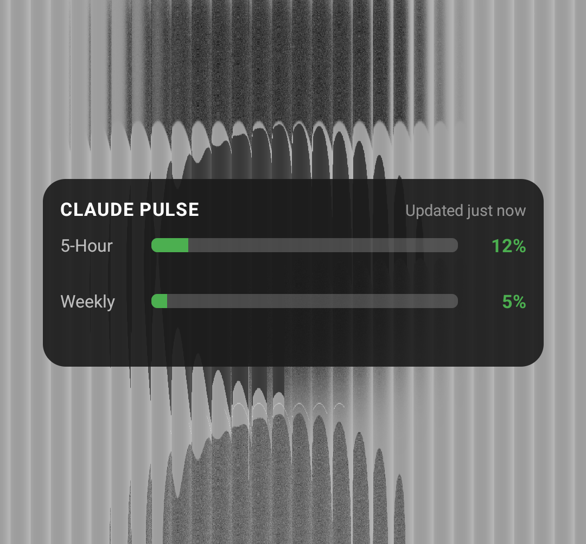
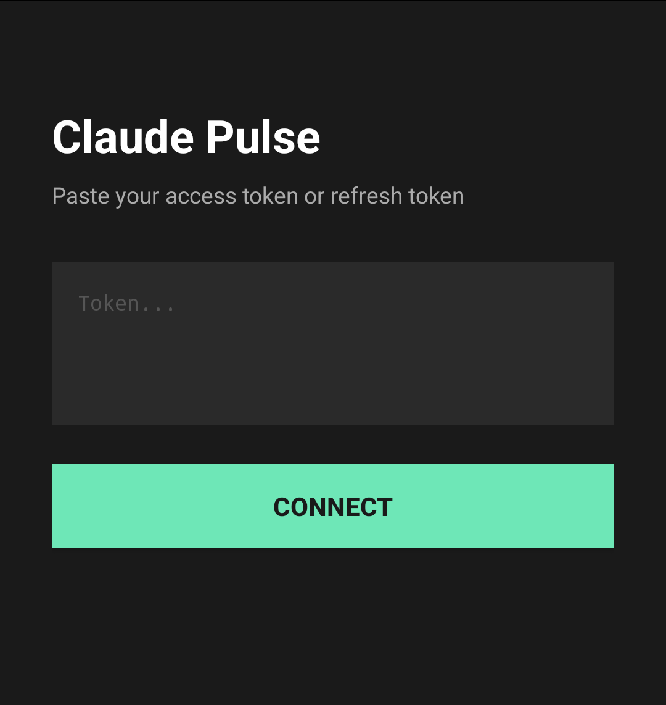

# Claude Pulse · Android

A minimal Android home screen widget that shows your Claude subscription usage at a glance. No app to open — the widget lives on your home screen and updates automatically.


---

<p align="center">
  
  &nbsp;&nbsp;&nbsp;
  
</p>

## What It Does

A resizable home screen widget that displays:

- **5-hour session utilization** — your current session window
- **7-day rolling utilization** — weekly usage across all models
- **Color-coded progress bars** — green / yellow / orange / red based on thresholds
- **Reset countdowns** — time remaining until each window resets
- **Auto-refresh** — updates every 10 minutes in the background

Tap the widget to open your Claude usage page in the browser.

### Widget Sizes

| Size | Layout |
|------|--------|
| **Compact** (3×1) | Two progress bars with percentages |
| **Standard** (4×2) | Full layout with labels and reset timers |
| **Expanded** (5×2) | Full layout with additional detail |

## How It Works

The app connects directly to Anthropic’s usage API from your phone. No server, no proxy, no middleman.

### Setup Flow

1. On your computer, run a helper script to extract your OAuth refresh token from Claude Code
2. Open Claude Pulse on your phone and paste the token into the setup screen
3. Done — the app handles token refresh and API calls from that point on

The refresh token is stored securely on your device using Android’s EncryptedSharedPreferences. Access tokens are refreshed automatically every ~8 hours.

### Why a Refresh Token?

Claude’s usage API uses OAuth authentication tied to Claude Code. There’s no standalone API key for usage data. The refresh token is a long-lived credential that lets the app obtain short-lived access tokens without re-authenticating. You extract it once, and the app maintains the session indefinitely.

## Prerequisites

| Requirement | Details |
|------------|--------|
| Android 8.0+ (API 26) | Covers 95%+ of active devices |
| Claude Code on a computer | Needed once, to extract the refresh token |
| Sideloading enabled | The APK isn’t on Google Play — you install it directly |

## Install

### 1. Get Your Refresh Token

On your Mac or Linux machine with Claude Code installed and signed in:

```bash
# macOS — reads from Keychain
security find-generic-password -s 'Claude Code-credentials' -w | python3 -c "
import sys, json
creds = json.load(sys.stdin)
print(creds.get('claudeAiOauth', {}).get('refreshToken', 'NOT FOUND'))
"
```

```bash
# Linux / alternative — reads from credentials file
python3 -c "
import json
with open('$HOME/.claude/.credentials.json') as f:
    creds = json.load(f)
print(creds.get('claudeAiOauth', {}).get('refreshToken', 'NOT FOUND'))
"
```

Copy the output. You’ll paste it into the app in a moment.

### 2. Install the APK

Download the latest APK from the [Releases](../../releases) page, or build from source (see below).

Transfer it to your phone and install. Android will ask you to allow installation from unknown sources — this is normal for sideloaded apps.

### 3. First Launch

Open Claude Pulse → paste your refresh token → tap **Connect**. The app will verify the token and start fetching usage data. Add the widget to your home screen from your launcher’s widget picker.

## Build from Source

```bash
git clone https://github.com/G-biggy/claude-pulse-android.git
cd claude-pulse-android

# Requires Android SDK and Java 17+
# If you don’t have the SDK:
#   brew install --cask android-commandlinetools   (macOS)
#   sdkmanager "platforms;android-34" "build-tools;34.0.0"

./gradlew assembleRelease
```

The APK will be at `app/build/outputs/apk/release/app-release-unsigned.apk`.

To sign it for your device:

```bash
# Generate a keystore (one-time)
keytool -genkey -v -keystore release.keystore -alias pulse -keyalg RSA -keysize 2048 -validity 10000

# Sign
apksigner sign --ks release.keystore --ks-key-alias pulse app/build/outputs/apk/release/app-release-unsigned.apk
```

## API Details

Same as the [Mac version](https://github.com/G-biggy/claude-pulse-mac) — this app uses **undocumented** Anthropic endpoints:

**Usage data:**
```
GET https://api.anthropic.com/api/oauth/usage
Authorization: Bearer <access_token>
anthropic-beta: oauth-2025-04-20
```

**Token refresh:**
```
POST https://console.anthropic.com/v1/oauth/token
Content-Type: application/json

{
  "grant_type": "refresh_token",
  "refresh_token": "<refresh_token>",
  "client_id": "9d1c250a-e61b-44d9-88ed-5944d1962f5e"
}
```

The `client_id` is Claude Code’s official OAuth client ID.

> **These endpoints are undocumented and may change without notice.** If the API changes, the widget will show an error state. Check this repo for updates.

### Color Thresholds

| Utilization | Color | Hex |
|-------------|-------|-----|
| 0–49% | 🟢 Green | `#4CAF50` |
| 50–74% | 🟡 Yellow | `#FF9800` |
| 75–89% | 🟠 Orange | `#FF5722` |
| 90–100% | 🔴 Red | `#F44336` |

## Project Structure

```
claude-pulse-android/
├── app/
│   └── src/main/
│       ├── java/com/.../claudepulse/
│       │   ├── ApiClient.kt        # Anthropic API + token refresh
│       │   ├── PulseWidget.kt      # Widget rendering and update logic
│       │   ├── UsageData.kt        # Data models
│       │   └── SetupActivity.kt    # One-time token setup screen
│       └── res/
│           ├── layout/             # Widget layouts (compact + full)
│           └── xml/                # Widget provider metadata
├── build.gradle.kts
├── LICENSE
└── README.md
```

## Security Notes

- Your refresh token is stored locally in EncryptedSharedPreferences — encrypted at rest on your device
- The token is never transmitted anywhere except directly to Anthropic’s servers over HTTPS
- No analytics, no tracking, no telemetry — the app talks to exactly one domain: `anthropic.com`
- The app requests only `INTERNET` and `RECEIVE_BOOT_COMPLETED` permissions

## Troubleshooting

**Widget shows "Offline"**
Check your internet connection. The widget retries on the next 10-minute cycle automatically.

**Widget shows "Auth Error"**
Your refresh token may have been revoked. Re-extract it from Claude Code on your computer and paste it into the app’s setup screen.

**Widget doesn’t appear in widget picker**
After installing the APK, you may need to restart your launcher. On most phones: long-press home screen → Widgets → search "Pulse".

## Acknowledgments

Companion project to [Claude Pulse · macOS](https://github.com/G-biggy/claude-pulse-mac).

The concept of monitoring Claude usage from a glanceable surface was inspired by [Blimp-Labs/claude-usage-bar](https://github.com/Blimp-Labs/claude-usage-bar). This project takes a simpler approach — a home screen widget instead of a full app, with direct API access instead of browser-based scraping.

## Disclaimer

This project is not affiliated with, endorsed by, or officially supported by Anthropic. It uses undocumented API endpoints that may change at any time. Use at your own discretion.

## License

MIT — do whatever you want with it. See [LICENSE](LICENSE) for details.
